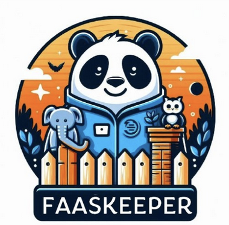

# gsoc-faaskeeper-work-product

Final work product for Google summer of code 2024.

1. What is the project about?

- FaaSKeeper is a ZooKeeper-like serverless coordination service. It implements standard ZooKeeper functionalities and includes a new client for Python applications. ZooKeeper has been used by many Apache projects. The goal of this project proposal is to identify an Apache project that can use FaaSKeeper instead of Zookeeper, define the Zookeeper APIs that will have to be implemented in FaasKeeper (if any) and create a new Java client library that offloads ZooKeeper calls to the REST cloud API of FaaSKeeper instead of using the ZooKeeper protocol. Ref: https://summerofcode.withgoogle.com/programs/2024/projects/VgcookyK

- FaaSKeeper is an implementation of this research paper: https://arxiv.org/abs/2203.14859

2. What was the goal of the GSoC project?
- A Python client library already existed for FaaSKeeper: https://github.com/spcl/faaskeeper-python

- The goal of this project was to develop a Java client library. And then integrate the java library with an Apache project.

3. What work was done? Show me the code.
- The Java client can be found here: https://github.com/spcl/faaskeeper-java

- The Hbase fork: https://github.com/spcl/hbase-faaskeeper

- Older commit history of the java client can be found in this repository: https://github.com/spcl/zookeeper/tree/dev

4. What work is remaining?
- There are several Zookeeper APIs. The Java client currently only supports a subset of these APIs that were sufficient to run HBase. (Read, Write and Update a ZNode).

- Please contact me if more Zookeeper APIs need to be added for your use case.

- FaaSKeeper supports multiple storage engines (DynamoDB and S3) and multiple communication channels (SQS, DynamoDB Queues). The Java library only uses DynamoDB as storage engine and SQS for communication because these were cost-effective and simplest to implement first.

5. How to run the code?
- Install Java8 (JDK 1.8)

- Deploy FaaSKeeper to your AWS account. Make note of the file `user-config-final.json` after deployment. Some values from this JSON will be needed later.
    - For deploying FaaSKeeper, refer to: https://github.com/spcl/faaskeeper
    - Configure FaaSKeeper to use DynamoDB for storage and SQS for communication

- Install HDFS. I use mac so I used `brew install hadoop` to install it. Use this HDFS config: 

- Clone the Java client repo. Run `mvn clean install` to install it in your local maven repository.

- Clone the `main` branch of this hbase fork (https://github.com/spcl/hbase-faaskeeper/tree/main) and run `mvn clean install  -Denforcer.skip=true  -DskipTests assembly:single -e` to build it
    - The build will be saved in a folder called `hbase-assembly/target`. Copy `hbase-2.5.8-bin.tar.gz` from `hbase-assembly/target` to a new folder

    - Decompress the tar files using tar -xvzf <PATH_TO_TAR_FILE>. This will create a new folder called `hbase-2.5.8`

    - Run: `cd hbase-2.5.8`

    - Replace `hbase-site.xml` in `conf` with the config from here:

    - Add this line to `hbase-env.sh`: `export HBASE_MANAGES_ZK=false`

    - Configure AWS credentials. You can use environment variables: `AWS_ACCESS_KEY_ID` and `AWS_SECRET_ACCESS_KEY`

    - Export path to FaaSKeeper config file: `export FK_CONFIG_FILE_PATH=<PATH_TO_FILE>`. Add the path to `user-config-final.json` that is generated at the end of deploying FaaSKeeper to AWS.

    - Start the master server by running: `./bin/hbase-daemon.sh start master`. Observe the logs using `tail -f <PATH_TO_LOG_FILE>`. Wait until the master is initialized and waiting for region server to start.

    - Start region server by running: `./bin/hbase-daemon.sh start regionserver`. Observe the logs using `tail -f <PATH_TO_LOG_FILE>`.

    - Ensure that both server and regionserver started successfully without any errors.

    - Run this Java main class to test Hbase. It creates a table and inserts data into it. Make sure to update the file path variable in `Runner.java`:  
        - To build the project, run: `mvn clean compile`

        - To start the script, run: `mvn exec:java -Dexec.mainClass="com.localhbaseclient.HbaseClientExample"`

6. What are some interesting learnings of mine from this project?
- DynamoDB:
    - DynamoDB supports both strongly consistent and eventually consistent reads. The reads are eventually consistent by default to prioritize high read throughput. Strongly consistent reads can be requested by the client. Strongly consistent reads are served by the leader, is more expensive and slower.
        - In order to make good use of write transactions, you'll have to learn to use Conditional Writes.
        - To prevent data consistency problems in DynamoDB caused by phantom read issues you should use conditional writes.

    - DynamodDB supports Read and Write serilizable ACID transactions. But transactions cannot have a combination of reads and writes. Ref: https://www.infoq.com/articles/amazon-dynamodb-transactions/

    - DynamoDB can be used for distributed locking with or without TTL. In fact there is a Java library by AWS that does this: https://github.com/awslabs/amazon-dynamodb-lock-client.
        - Ideally Optimistic locking based on version or timestamp should be used for DynamoDB

        - Pessmisitic locking can cause issues if a lock is never released. Pessimistic locking works well for connection based DBs like MySQL. Such a lock can remain until the connection stays alive or until some pre-determined timeout

- SQS:
    - SQS is a distributed system. A record might end up getting sent twice. Ensure that your consumers are idempotent.
        - AWS Lamba powertools has a lib for this: https://docs.powertools.aws.dev/lambda/python/latest/utilities/idempotency/1

    - Importance of Dead Letter Queues (DLQs) for handling message processing failures: A DLQ is used to store messages that cannot be successfully processed after a specified number of retries. This prevents problematic messages, often referred to as "poison pill" messages, from clogging the main queue. Such messages may be malformed or trigger errors in the application logic. By configuring a DLQ, you can ensure that these messages are redirected for later analysis without impacting the performance of the main queue.

    - AWS SQS FIFO queues guarantee that messages are processed in the exact order they are sent. Messages that belong to the same message group (ie same MessageGroupId) are always processed one by one, in a strict order relative to the message group (however, messages that belong to different message groups might be processed out of order).

- Monkey Patching:
    - TODO

6. What was the high-level implementation plan?
    - TODO